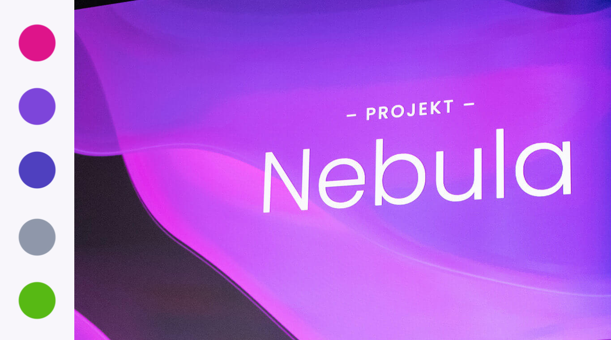
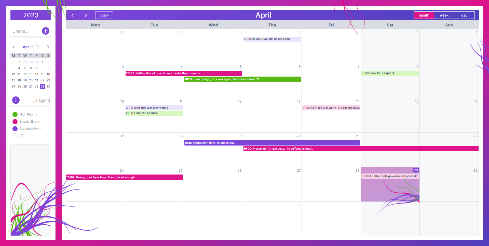
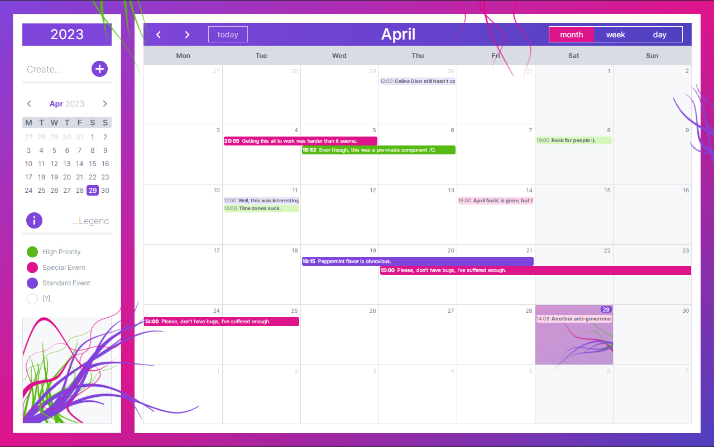
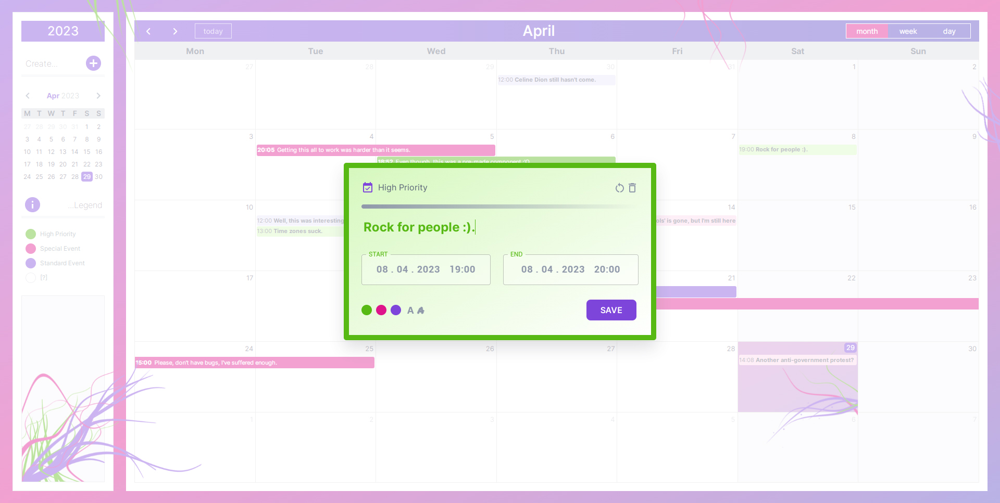

# NEBULA CALENDAR

This is a custom full calendar solution for the 2. round of a junior frontend dev challenge.

### LIVE DEMO: [https://event-calendar-tron.vercel.app/](https://event-calendar-tron.vercel.app/)

### The challenge - [x]

#### Tech specification:

- [ ] App is developed in React 18
- [ ] With helper libraries such as @fullcalendar and @mui
- [ ] Written and typed using TypeScript (^4.9.0)
- [ ] And designed for (> 1280px)

#### Requirements:

- [ ] Single-page app
- [ ] with a **calendar view** (month | week | day)
- [ ] months can be moved forwards and backwards
- [ ] week starts with **Monday** and ends with **Sunday**
- [ ] (colorful) indication of a **current day**
- [ ] every day can have **0 - n events**
- [ ] events can be **added** and **removed**
- [ ] the EVENT object must have:
  - **title** - string, required
  - **from** (time) - date, required
  - **to** (time) - date, required
  - **color** - string, optional

#### BONUS challenge

- [ ] events can be edited (a modal will pop open, with editing options)
- [ ] form is being validated (title can't be empty & start date can't be older than end date)
- [ ] events can be spread over multiple days
- [ ] **today** button, which moves calendar view back to current day
  - **side panel** with a small calendar for a date "quick pick", **create** button (apart from clicking on the full calendar grid) & color legend
- [x] app is not optimised for mobile (WORK IN PROGRESS)
- [x] app is deployed online (see link above)

## My process

### Built with

- Semantic HTML5 markup
- CSS custom properties using Tailwind & Sass
- [React](https://reactjs.org/) - JS library with [Vite](https://vitejs.dev/) build

### Color palette

- inspired by the Nebula theme
  

### Useful resources & notes

- [Full Calendar Docs](https://fullcalendar.io/docs/) - Not very "intuitive" (haha) for customizing CSS and design.
- [Steps to build a calendar](https://medium.com/@kapaak/custom-calendar-with-react-and-dayjs-dcdbba89e577) - Introduced me to the basic functionality and dayjs formatter. I ended up using this tut to build a small side panel calendar.

## How to install & run

First, run the development server:

```bash
npm install
npm run dev
# or
yarn install
yarn dev
```

### Screenshots

## Desktop version:




